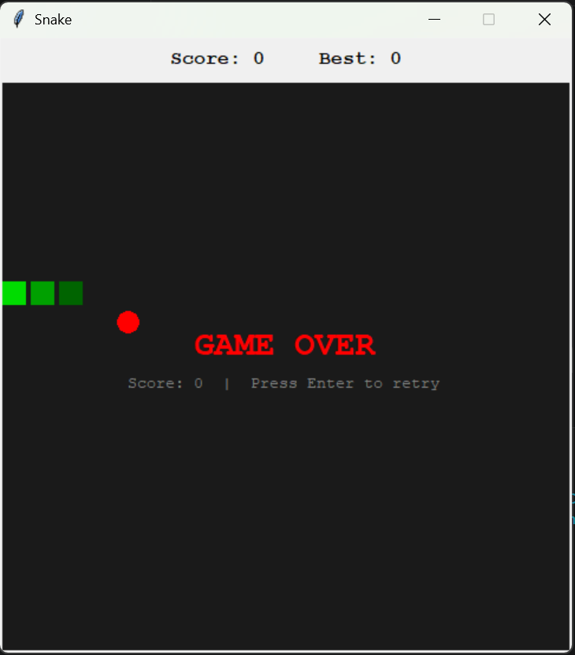

# 🐍 Snake Game


## 📖 Description

A classic Snake game built with Python using the tkinter library.
Control the snake, eat the food, and grow longer—but don’t hit the walls or yourself!

---

## 🎮 Demo

*(Add a screenshot or GIF here)*

```markdown

```

---

## ✨ Features

* 🟢 Smooth snake movement
* 🍎 Random food spawning
* 📈 Score tracking
* 🐍 Snake grows after eating food
* 💥 Collision detection (walls & self)
* 🔁 Automatic restart on game over

---

## 🛠️ Requirements

* Python 3.x
* tkinter (included with most Python installations)

---

## ⚙️ Installation

```bash id="inst7721"
git clone https://github.com/your-username/snake-game.git
cd snake-game
```

---

## ▶️ Usage

```bash id="run8821"
python main.py
```

---

## 🎯 Controls

| Key | Action     |
| --- | ---------- |
| ⬆️  | Move Up    |
| ⬇️  | Move Down  |
| ⬅️  | Move Left  |
| ➡️  | Move Right |

---

## 📂 Project Structure

```id="struct882"
snake-game/
│── main.py
│── README.md
│── screenshot.png   # (optional)
```

---

## 🧠 Game Logic

* The snake is stored as a list of positions.
* Each update:

  * The snake moves forward
  * The head checks for collisions
* When food is eaten:

  * The snake grows
  * Score increases
* Game resets on collision with walls or itself

---

## 🚀 Future Improvements

* 🎵 Sound effects
* ⏸️ Pause / Resume
* ⚡ Increasing difficulty
* 🏆 High score system
* 🎨 Better graphics

---

## 🤝 Contributing

Contributions are welcome!

1. Fork the repository
2. Create a new branch
3. Make your changes
4. Submit a pull request

---

## 📜 License

This project is licensed under the MIT License.

---

## 👨‍💻 Author

Romeo Monwabise Hlakona

---

## ⭐ Support

If you like this project, give it a star ⭐ on GitHub!
